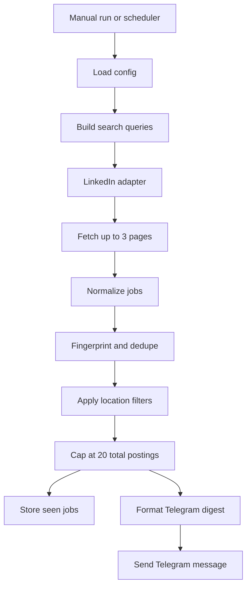

# JobBot POC

Portable job-search automation POC for morning job alerts.

## What it does

- Runs on a schedule or manually.
- Searches LinkedIn Jobs only.
- Searches up to 3 LinkedIn result pages per query.
- Normalizes and deduplicates results.
- Caps each run at 20 total postings.
- Sends a digest to Telegram.
- Persists seen jobs in SQLite so repeat runs do not spam duplicates.

## Scope

This is a proof of concept, not a full production pipeline.

## Project layout

```text
automate_bot/
  .env.example
  config.example.yaml
  pyproject.toml
  scripts/
  launchd/
  src/jobbot/
  tests/
```

## High-level flow



## Quick start

1. Create a virtual environment.
2. Install dependencies.
3. Copy `.env.example` to `.env` and fill in secrets.
4. Copy `config.example.yaml` to `config.yaml` and adjust keywords or locations.
5. Run `jobbot run --config config.yaml`.

## Running live

For production-style runs, do not keep the script open manually. Use a scheduler on the machine running the bot.

Recommended schedule:

- 8:00 AM
- 9:00 AM
- 10:00 AM

Example crontab entries:

```cron
0 8 * * * cd /PATH/TO/automate_bot && /PATH/TO/automate_bot/scripts/run_jobbot.sh >> .jobbot/run.log 2>&1
0 9 * * * cd /PATH/TO/automate_bot && /PATH/TO/automate_bot/scripts/run_jobbot.sh >> .jobbot/run.log 2>&1
0 10 * * * cd /PATH/TO/automate_bot && /PATH/TO/automate_bot/scripts/run_jobbot.sh >> .jobbot/run.log 2>&1
```

That sends Telegram only when new jobs are found.

For macOS, you can also use the included `launchd/com.jobbot.plist.example` file as a template.

## Environment variables

Set these before sending messages:

- `JOBBOT_TELEGRAM_BOT_TOKEN`
- `JOBBOT_TELEGRAM_CHAT_ID`
- `JOBBOT_LINKEDIN_EMAIL`
- `JOBBOT_LINKEDIN_PASSWORD`

Optional browser settings:

- `JOBBOT_BROWSER_HEADLESS=true|false`
- `JOBBOT_BROWSER_PROFILE_DIR=.browser-profile`
- `JOBBOT_BROWSER_SLOW_MO_MS=0`

App settings:

- `browser_max_pages: 3`

## Important notes

- LinkedIn search relies on the `f_TPR` URL parameter described in the PDF.
- The browser-based collectors are designed to be resilient, but selectors may need tuning as sites change.
- The current run logic collects jobs in discovery order and stops at 20 total postings per run.
- Keep login/session handling inside the browser profile. Do not hardcode credentials.
- Telegram messages are sent in HTML format with clickable links.
- The project is designed so you can copy the folder to another machine, create a venv, and run it there.
- On macOS, use `launchd/com.jobbot.plist.example` as a template and replace `__PROJECT_DIR__` with the real path.

## Running tests

```bash
pytest
```
